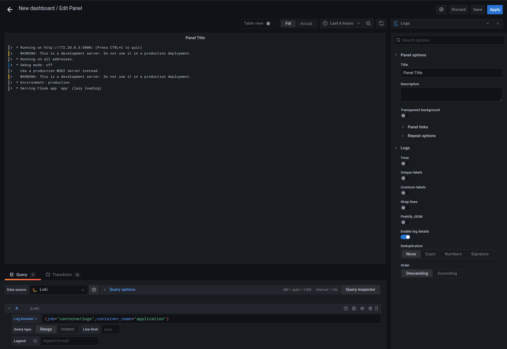
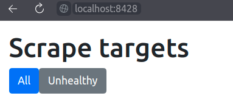
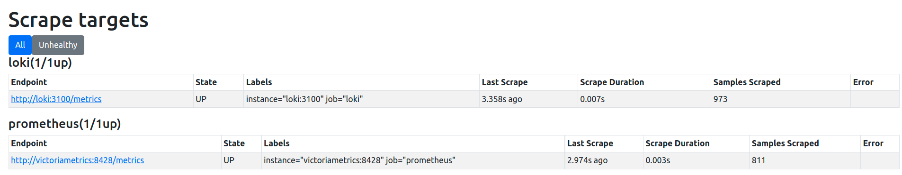
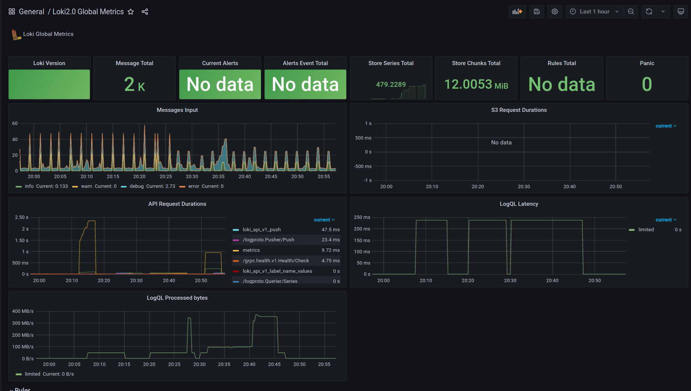
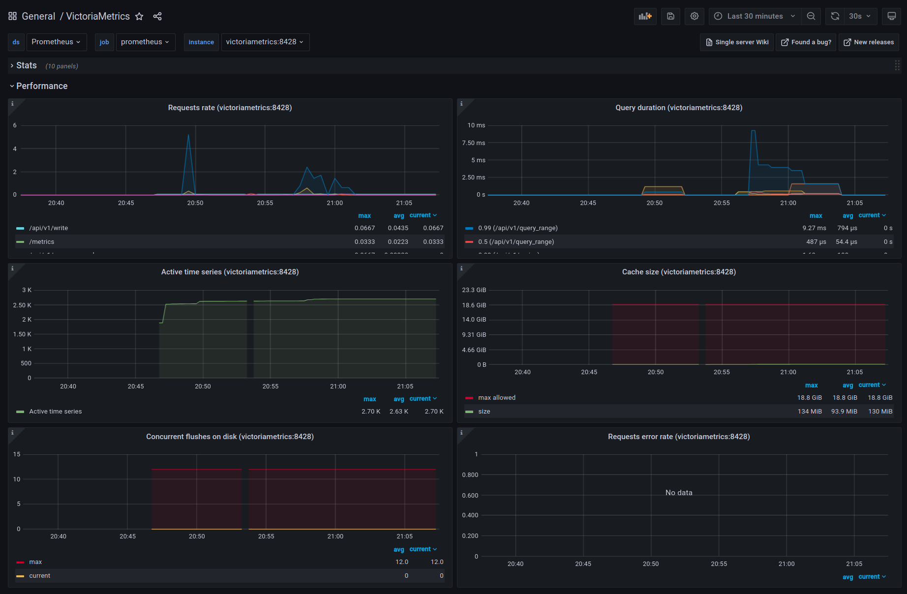

# Logging & metrics

## Success screenshot

Logs are collected from all docker containers. In particular, we can filter by them
to see our python app logs.

## Victoriametrics screenshots

Victoriametrics does not have targets itself

Instead, VM agent pushes metrics to VM. However, we can still see victoriametrics
agent's targets, if we open it's port

Configured dashboards

## Best practices

1. Save Grafana state postgresql (currently in the same docker-compose,
    but can be easilly replaced with remote
1. Grafana is configured via docker secrets (see [url](https://grafana.com/docs/grafana/latest/administration/configure-docker/#configure-grafana-with-docker-secrets))
1. Tags in promtail.
1. Ensure that log levels are correctly parsed.
1. Configure log file rotation.
1. Configure max log size
1. Victoriametrics is used as prometheus storage. It is scalable horizontally
    and vertically, supports global query view and we can push metrics into it
    instead of having static scrape config (restart with each new target)
